<div align="center">
  <table border="1">
    <tr>
      <td align="center" style="padding: 20px;">
        <h3>📢 Domain & Email Migration Notice</h3>
        <p>From <b>6 May 2026</b>, Simutrade will transition to new domains as <code>simutrade.app</code> will not be renewed:</p>
        <p>🌐 <b>Website:</b> <a href="https://simutrade.faizath.com">simutrade.faizath.com</a> (formerly <i>simutrade.app</i>)<br>
        ⚙️ <b>API:</b> <a href="https://simutrade-api.faizath.com">simutrade-api.faizath.com</a> (formerly <i>api.simutrade.app</i>)<br>
        📧 <b>Email:</b> <a href="mailto:contact@simutrade.faizath.com">contact@simutrade.faizath.com</a> (formerly <i>contact@simutrade.app</i>)<br>
        🛰️ <b>CDN:</b> <a>simutrade-cdn.faizath.com</a> (formerly <i>cdn.simutrade.app</i>)<br>
        📈 <b>Status Pages:</b> <a href="https://status.faizath.com/status/simutrade">https://status.faizath.com/status/simutrade</a> (formerly <i>status.simutrade.app</i>)
        </p>
      </td>
    </tr>
  </table>
</div>

<div align="center">
  
  <h1 align="center">🚀 SimuTrade API</h1>
  <h3 align="center">AI-Powered Trade Supply Chain Simulation Backend API</h3>
  
  <p align="center">
    
  </p>
  
  <p align="center">
    <a href="https://simutrade.app">🌐 Live Demo</a> •
    <a href="https://api.simutrade.app">🔗 API</a> •
    <a href="https://status.simutrade.app">📊 Status</a> •
    <a href="#-competition-achievement">🏆 Achievement</a> •
    <a href="#-repositories">📁 Repositories</a> •
    <a href="#-tech-stacks">🛠️ Tech Stack</a>
  </p>
</div>

## 🌟 What is SimuTrade API?

**SimuTrade API** is the robust backend service that powers the SimuTrade platform, providing RESTful APIs, real-time WebSocket communications, and AI-powered trade analysis. Built with Node.js and Express, it handles user authentication, data processing, and seamless integration with AI services for comprehensive trade supply chain simulation.

### ✨ Key Features

- 🔐 **Secure Authentication**: JWT-based authentication with Google OAuth2 integration
- 🌐 **RESTful APIs**: Comprehensive API endpoints for trade data, user management, and analytics
- 🔄 **Real-time Communication**: WebSocket support for live trade simulation updates
- 🤖 **AI Integration**: Seamless connection with AI services for trade pattern analysis
- 📊 **Data Processing**: Advanced data processing and analytics capabilities
- 📧 **Email Services**: Automated email notifications and verification
- 🗄️ **Database Management**: MongoDB integration for scalable data storage
- 📄 **PDF Generation**: Dynamic PDF report generation for trade analysis
- ☁️ **Cloud Storage**: Cloudflare R2 integration for file storage and management

### 🎯 API Capabilities

- **User Management**: Registration, authentication, and profile management
- **Trade Simulation**: Real-time trade scenario processing and analysis
- **Data Analytics**: Comprehensive trade data processing and insights
- **File Management**: Secure file upload, storage, and retrieval
- **Report Generation**: Dynamic PDF and document generation
- **AI Chat Integration**: RAG-powered chat endpoints for trade insights
- **Agent Services**: Custom AI agent endpoints for specialized trade analysis

## 🏆 Competition Achievement

### 🥇 Google APAC Solutions Challenge 2025 - Top 10 Finalist

**SimuTrade** was selected as a **Top 10 Finalist** in the prestigious **Google APAC Solutions Challenge 2025** hackathon! Our team **ITBebas** had the incredible opportunity to travel to the Philippines and present our solution at the Asian Development Bank Headquarters.

<div align="center">
  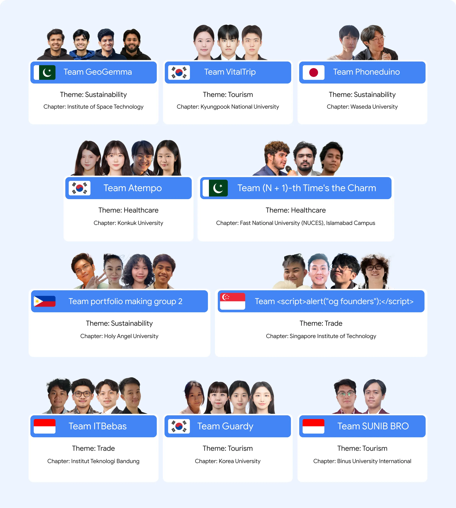
  <p><em>SimuTrade recognized as Top 10 Finalist in Google APAC Solutions Challenge 2025</em></p>
</div>

### 🌟 Our Journey

- **🏢 Google Philippines Office Visit**: Our team had the privilege of visiting Google's Philippines office, experiencing the innovative culture and meeting with Google engineers
- **🏛️ Asian Development Bank Presentation**: We presented SimuTrade at the Asian Development Bank Headquarters, showcasing our AI-powered trade simulation platform to industry experts
- **🎯 Top 10 Achievement**: While we didn't reach the Top 3, being selected as a Top 10 finalist was an incredible honor and validation of our solution's potential
- **🤝 Networking & Learning**: The experience provided invaluable networking opportunities and insights into the future of trade technology

### 📚 Competition Resources

- **Official Competition**: [Google APAC Solutions Challenge 2025](https://vision.hack2skill.com/event/apacsolutionchallenge)
- **Archived Competition Page**: [Archive Version](https://archive.faizath.com/archive/1751469385.462976/index.html)

<div align="center">
  
  
  <p><em>Our team at Google Philippines Office and the awarding ceremony at Asian Development Bank</em></p>
</div>

This achievement demonstrates SimuTrade's potential to revolutionize global trade simulation and its recognition by leading technology and development organizations.

## 🏗️ Repository Architecture

SimuTrade is built as a modular, microservices-based architecture with three main repositories:

### 📱 Frontend Repository
**Repository**: [simutrade-app/simutrade-fe](https://github.com/simutrade-app/simutrade-fe)  
**Live URL**: [simutrade.app](https://simutrade.app)  
**Description**: Modern React-based user interface with TypeScript, featuring interactive dashboards, real-time maps, and AI-powered analytics.

### 🔧 API Backend Repository (This Repository)
**Repository**: [simutrade-app/simutrade-api](https://github.com/simutrade-app/simutrade-api)  
**Live URL**: [api.simutrade.app](https://api.simutrade.app)  
**Description**: RESTful API server handling business logic, data processing, user authentication, and real-time WebSocket communications.

### 🧠 AI & RAG Backend Repository
**Repository**: [simutrade-app/simutrade-ai](https://github.com/simutrade-app/simutrade-ai)  
**Description**: Specialized AI service providing machine learning models, natural language processing, trade pattern recognition, and intelligent recommendations using Retrieval-Augmented Generation (RAG) techniques.


<p align="center">
  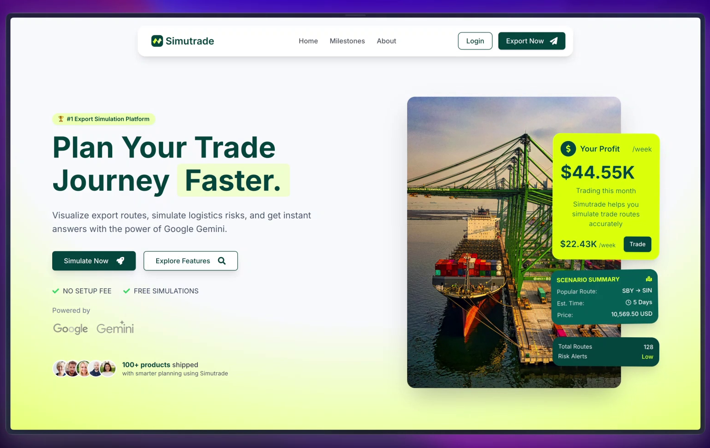
  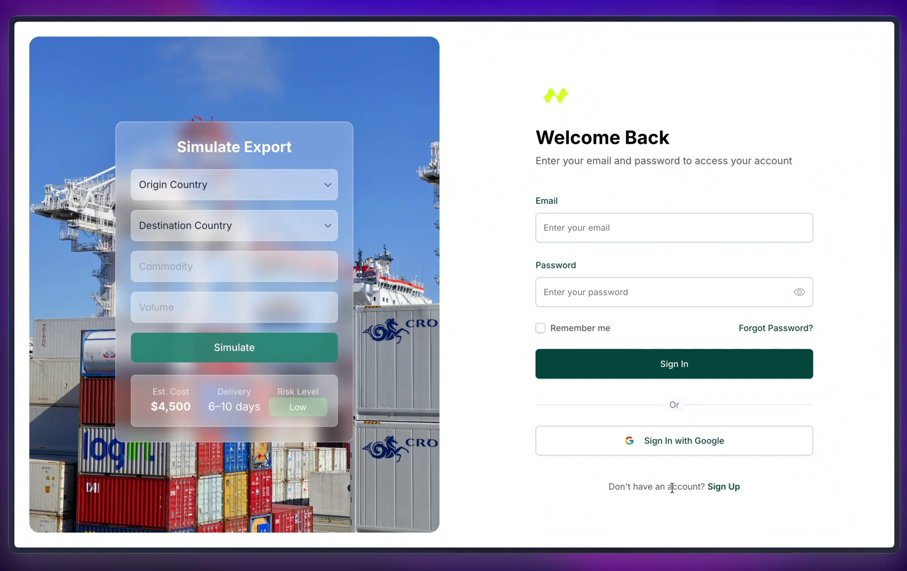
  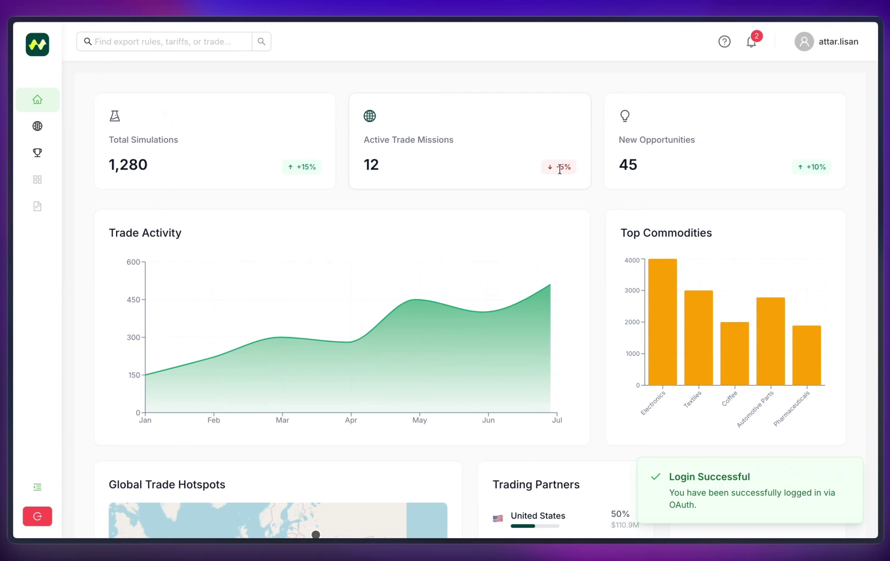
  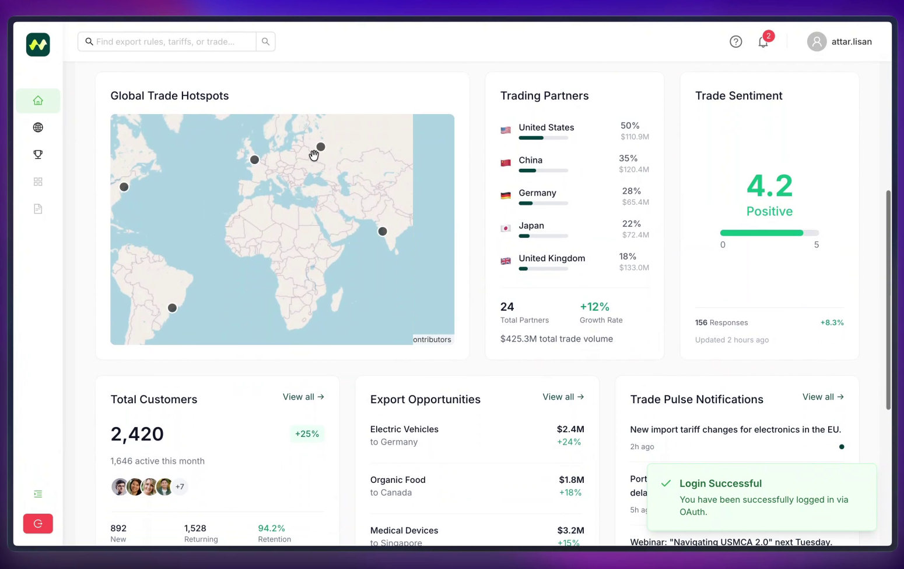
  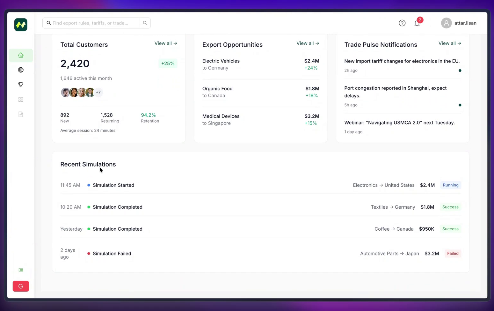
  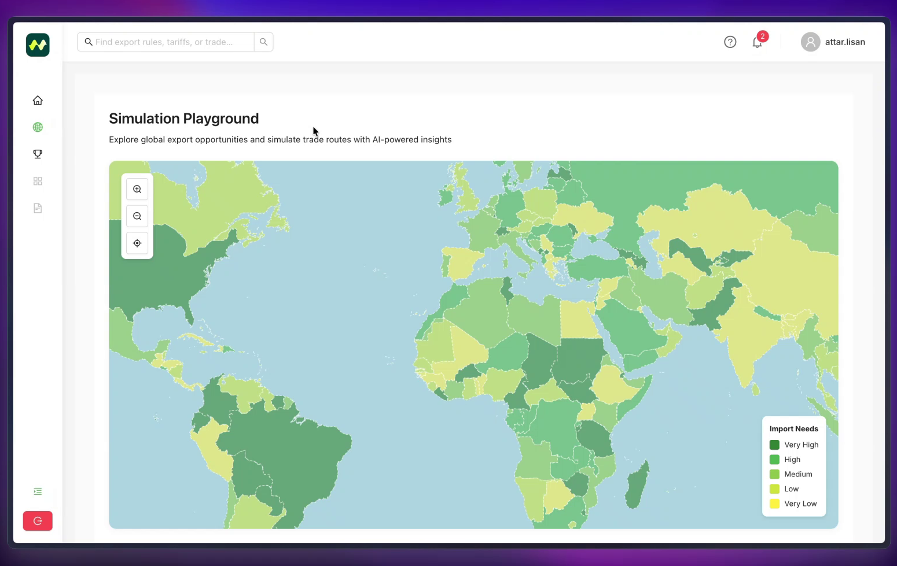
  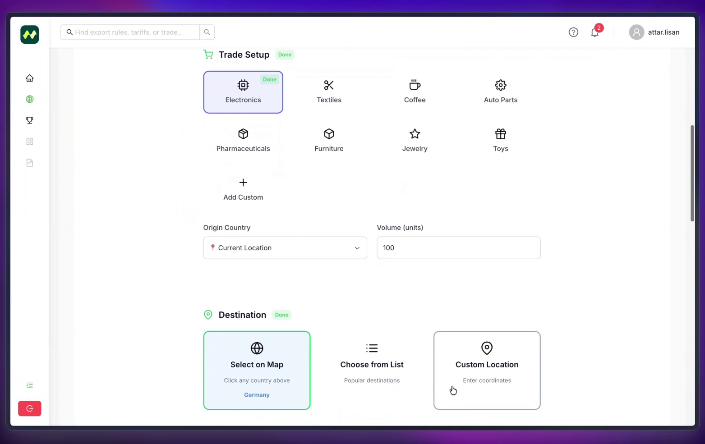
  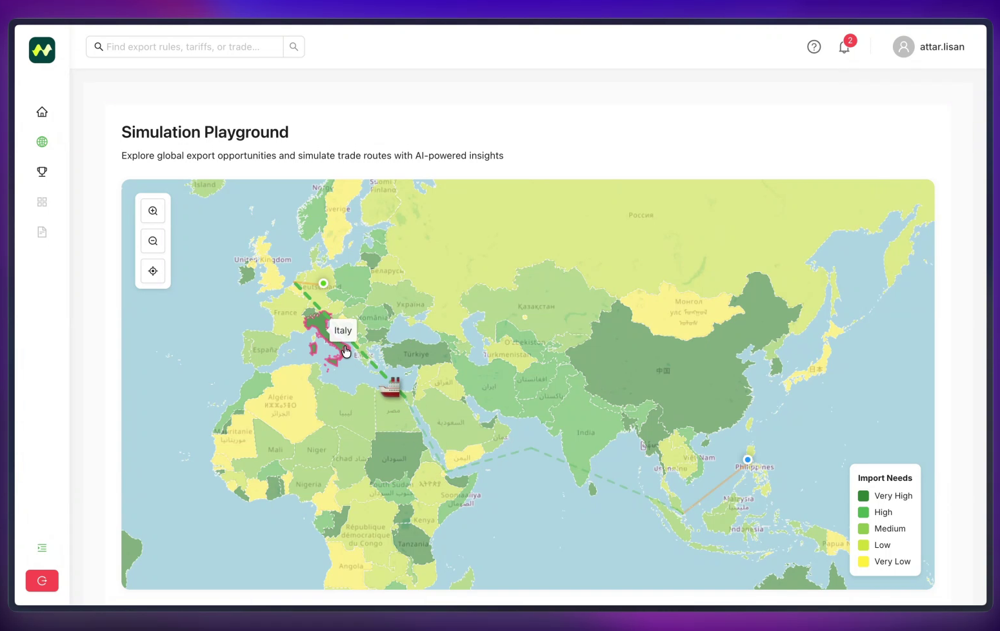
  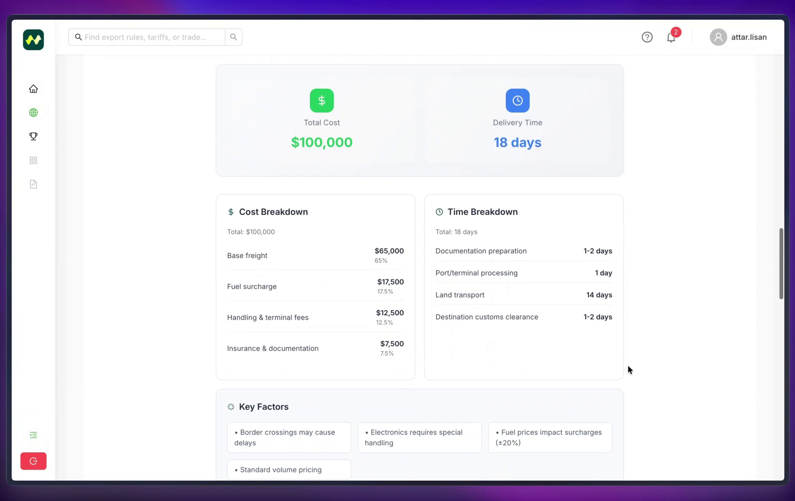
  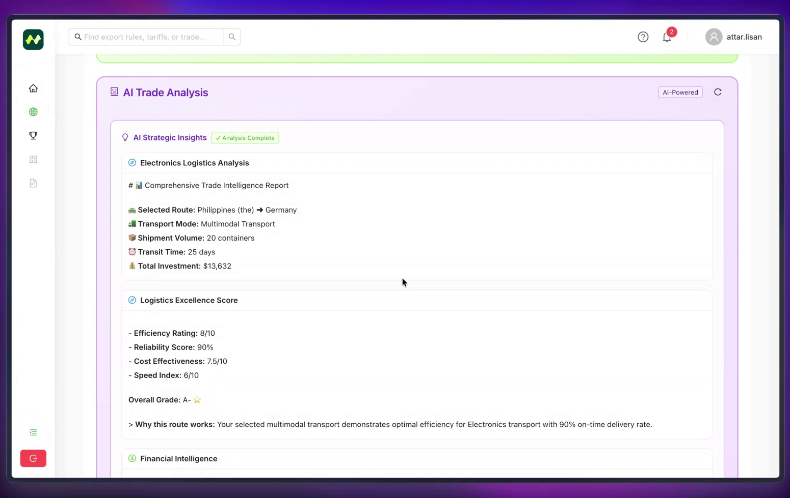
</p>

## 🛠️ Tech Stacks

### 🚀 Backend Framework & Core
| Technology | Purpose | Description |
|------------|---------|-------------|
| **Node.js** | Runtime | JavaScript runtime for server-side development |
| **Express.js** | Web Framework | Fast, unopinionated web framework for Node.js |
| **CommonJS** | Module System | Standard module system for Node.js applications |

### 🔐 Authentication & Security
| Technology | Purpose | Description |
|------------|---------|-------------|
| **JWT (jsonwebtoken)** | Authentication | JSON Web Token implementation for secure authentication |
| **Passport.js** | Authentication Strategy | Authentication middleware for Node.js |
| **Passport Google OAuth2** | OAuth Integration | Google OAuth2 strategy for Passport.js |
| **bcrypt** | Password Hashing | Secure password hashing and verification |
| **Express Session** | Session Management | Session middleware for Express applications |

### 🗄️ Database & Data Management
| Technology | Purpose | Description |
|------------|---------|-------------|
| **MongoDB** | Database | NoSQL document database for flexible data storage |
| **Mongoose** | ODM | Elegant MongoDB object modeling for Node.js |

### 🌐 HTTP & API
| Technology | Purpose | Description |
|------------|---------|-------------|
| **Body Parser** | Request Parsing | Parse incoming request bodies in middleware |
| **CORS** | Cross-Origin | Enable Cross-Origin Resource Sharing |
| **Express** | Web Server | Web application framework for Node.js |

### ☁️ Cloud Services & Storage
| Technology | Purpose | Description |
|------------|---------|-------------|
| **Cloudflare R2** | Object Storage | S3-compatible object storage service |
| **node-cloudflare-r2** | R2 Client | Node.js client for Cloudflare R2 storage |

### 📧 Communication & Notifications
| Technology | Purpose | Description |
|------------|---------|-------------|
| **Nodemailer** | Email Service | Email sending library for Node.js applications |

### 📄 Document Generation
| Technology | Purpose | Description |
|------------|---------|-------------|
| **node-latex** | PDF Generation | LaTeX to PDF conversion for document generation |

### 🛠️ Development Tools
| Technology | Purpose | Description |
|------------|---------|-------------|
| **Nodemon** | Development | Automatic server restart during development |
| **dotenv** | Environment | Load environment variables from .env file |

## ⚙️ Installation & Setup

### 🚀 Quick Start

1. **Clone the API Repository**
   ```bash
   git clone https://github.com/simutrade-app/simutrade-api.git
   cd simutrade-api
   ```

2. **Install Dependencies**
   ```bash
   npm install
   ```

3. **Environment Configuration**
   ```bash
   cp template.env .env
   # Edit .env with your configuration
   ```

4. **Start Development Server**
   ```bash
   npm run dev
   ```

5. **Start Production Server**
   ```bash
   npm start
   ```

### 📋 Available Scripts

| Command | Description |
|---------|-------------|
| `npm start` | Start production server |
| `npm run dev` | Start development server with auto-restart |
| `npm install` | Install all dependencies |

### 🔧 Development Requirements

- **Node.js**: Version 18 or higher
- **npm**: Version 8 or higher
- **MongoDB**: Database server for data storage
- **Environment Variables**: Configure `.env` file with required settings

### 🌐 Production Deployment

The API is automatically deployed to [api.simutrade.app](https://api.simutrade.app) using modern CI/CD pipelines with:
- **API Backend**: [api.simutrade.app](https://api.simutrade.app)
- **Frontend**: [simutrade.app](https://simutrade.app)
- **AI Services**: Integrated with the main platform

### 📊 System Status

Monitor the real-time status of all SimuTrade services:
- **Status Page**: [status.simutrade.app](https://status.simutrade.app/)
- **Services Monitored**:
  - 🌐 SimuTrade Web (simutrade.app)
  - 🔗 SimuTrade API (api.simutrade.app)
  - 🤖 SimuTrade AI
  - 🗄️ SimuTrade MongoDB
  - 📡 SimuTrade CDN (cdn.simutrade.app)

## 🤝 Contributing

We welcome contributions from the community! Here's how you can help:

### 🐛 Bug Reports
- Use GitHub Issues to report bugs
- Include steps to reproduce the issue
- Provide system information and error logs

### 💡 Feature Requests
- Submit feature requests via GitHub Issues
- Describe the use case and expected behavior
- Consider the impact on existing functionality

### 🔧 Development Setup
1. Fork the repository
2. Create a feature branch: `git checkout -b feature/amazing-feature`
3. Make your changes and add tests
4. Run the test suite: `npm test`
5. Commit your changes: `git commit -m 'Add amazing feature'`
6. Push to the branch: `git push origin feature/amazing-feature`
7. Open a Pull Request

### 📋 Code Standards
- Follow Node.js and Express.js best practices
- Use proper error handling and logging
- Write comprehensive tests for new features
- Update API documentation as needed

## 🏆 Acknowledgments

- **Node.js Team** for the amazing runtime
- **Express.js Team** for the robust web framework
- **MongoDB Team** for the flexible database solution
- **All Contributors** who help make SimuTrade better

## 📞 Support & Contact

- **Website**: [simutrade.app](https://simutrade.app)
- **API Documentation**: [api.simutrade.app](https://api.simutrade.app)
- **Issues**: [GitHub Issues](https://github.com/simutrade-app/simutrade-api/issues)
- **Discussions**: [GitHub Discussions](https://github.com/simutrade-app/simutrade-api/discussions)

## 📝 License

This project is licensed under the **MIT License** - see the [LICENSE](LICENSE) file for details.

---

<div align="center">
  <p>Made with ❤️ by the SimuTrade Team</p>
  <p>
    <a href="https://simutrade.app">🌐 Visit SimuTrade</a> •
    <a href="https://github.com/simutrade-app">👥 Our Organization</a> •
    <a href="https://github.com/simutrade-app/simutrade-api/stargazers">⭐ Star this repo</a>
  </p>
</div>